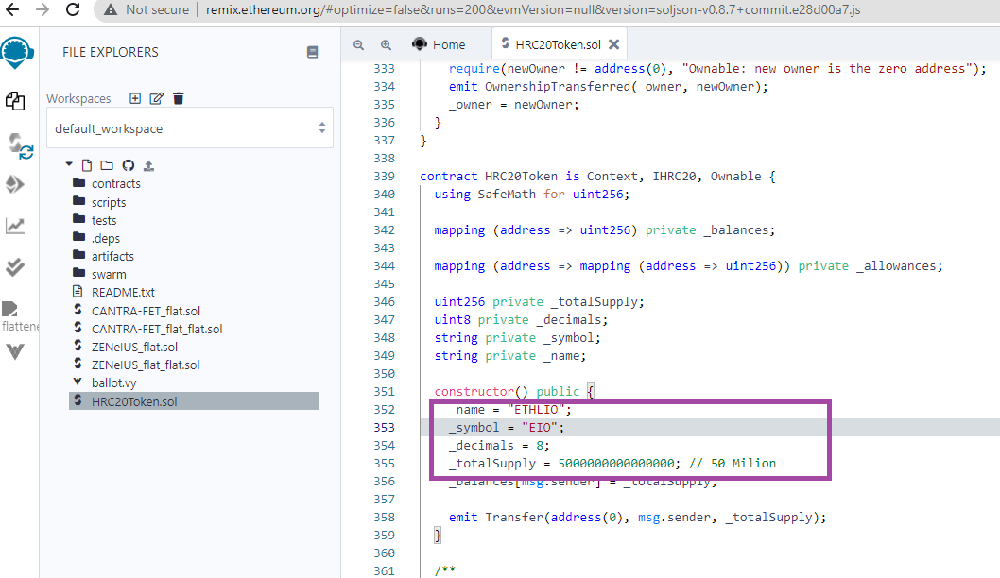

#  HashPEChain


### Usage

Download HRC20Token.sol, Please make the below changes as per your requirement and compile with Remix IDE

``` solidity

contract HRC20Token is Context, IHRC20, Ownable {
  using SafeMath for uint256;

  mapping (address => uint256) private _balances;

  mapping (address => mapping (address => uint256)) private _allowances;

  uint256 private _totalSupply;
  uint8 private _decimals;
  string private _symbol;
  string private _name;

  constructor() public {
    _name = {{TOKEN_NAME}};
    _symbol = {{TOKEN_SYMBOL}};
    _decimals = {{DECIMALS}};
    _totalSupply = {{TOTAL_SUPPLY}};
    _balances[msg.sender] = _totalSupply;
```

 


## License

HashPEChain Contracts is released under the [MIT License](LICENSE).
